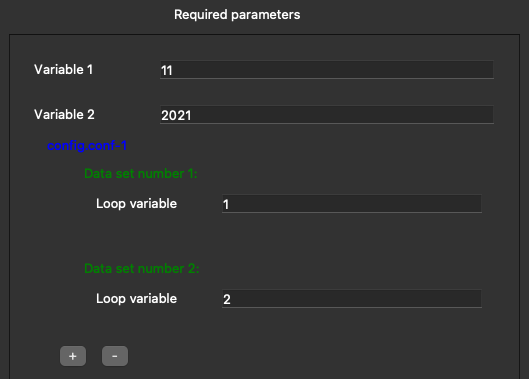

# Configuration files generator

## Usage

Application looks for templates in folder _./templates_ by default. User can change templates folder with button "Templates".

Default output folder is _./configs_. User also can change this by using "Out dir" button.

When templates folder is chosen, application will load all templates and render required fields for user to fill in. User can choose only desired templates from the list to generate. Required fields will changes accordingly to selected templates.

## Template description
In this application we use a very simple template engine for describing desired configuration file. 

The template filename has the form: _configuration_filename_.txt

In example: _config.conf_.txt

A template has 2 designed components:
* Variable
* Loop

### Variable
A variable is defined as following:     _${VariableName;VariableType;VariableDescription}$_
* VariableName: can consists all letters (uppercase recommended), numbers, and underscore
* VariableType: the same as VariableName, if specified type is not supported, type STRING will be used instead.
* VariableDescription: description for the variable, words and spaces are allowed.

### Loop
Loop is a part of a template, consists of one or more lines, which can be repeated a number of time with different input data sets. A loop can have zero, one, or many variables. A loop can also have loop inside its structure (sub-loop).

A loop starts with line BEGIN_LOOP, and ends with line END_LOOP.

## Example
`config.conf.txt`

---

```Bash
var_1=${VAR_1;NUM;Variable 1}$
var_2=${VAR_2;NUM;Variable 2}$

BEGIN_LOOP
{
    loop_var=${LOOPVAR;NUM;Loop variable}$
}
END_LOOP
```
---



---

Generated file

```Bash
var_1=11
var_2=2021

{
    loop_var=1
}
{
    loop_var=2
}
```